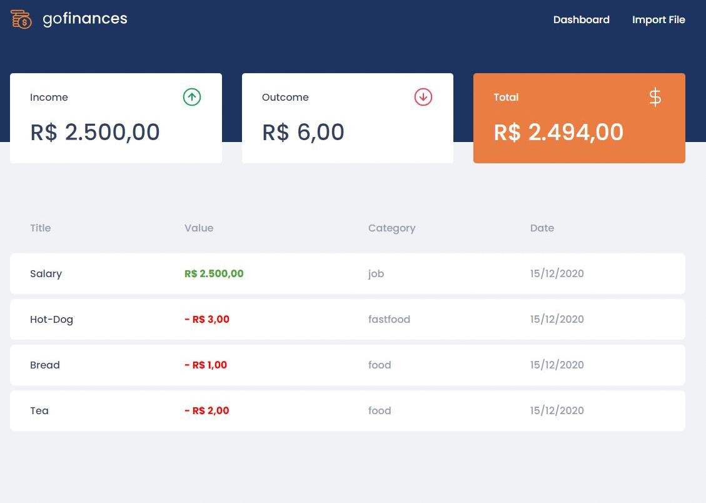

  

<h1 align="center">GoFinance - Web FrontEnd</h1>

---

 
In this ReactJS application I contined to develop the transaction management application named GoFinances that already have a backend. 
Now, along with the use of TypeScript, routes, and sending files, the application will connect to the previous created backend and display the transactions. Also it is possible now to import a CSV file to generate new records in the database.
  

  

  

##  

---

## 📝 Table of Contents

- [About](#about)
- [Getting Started](#getting_started)
- [Built Using](#built_using)
- [Dependencies](#dependencies)
- [Author](#authors)
- [Acknowledgments](#acknowledgement)

##  

---

## 🧐 Application features 

- **_List the backend's API transactions:_** the Dashboard page should be able to display a listing through a table, with the title, value, type and category field for all transactions that are registered in the API.
- **_Display the balance:_** On the Dashboard page, it is possible to check the balance that is returned from the backend, containing the income total, the outcome total and the final balance.
- **_Import CSV files:_** the Import page allow users to send a file in csv format to your backend, which will import the transactions into your database.

With this application the user is able to: 
navigate between two pages using react's single page concept  
list the total balance inside the cards  
list the transactions  
upload a file

##  

---

## 🏁 Getting Started 

In order to get a copy of this project an run on your local machine for development and testing purposes you will need to clone the project, run the "yarn" command on your terminal to install all the dependencies and execute the command "yarn start".
It is also important to mention that this project requires a running database to get the data, for more information on the backend of this project check this repository: (BACKEND LINK)

##  

---

## ⛏️ Built Using 

- [PostgreSQL](https://www.postgresql.org/) - Database
- [Express](https://expressjs.com/) - Server Framework
- [ReactJS](https://reactjs.org/) - Web Framework
- [NodeJs](https://nodejs.org/en/) - Server Environment
- [Insomnia](https://insomnia.rest/) - Rest Client
- [DBeaver](https://dbeaver.io/) - DB administration tool
- [Docker](https://www.docker.com/) - Docker Container
- [Typescript](https://www.typescriptlang.org/) - Programming Language

##  

---

## 🔁 Dependencies 

Some project library dependencies includes but are not limited to:

- "dependencies": {
- "axios": "^0.19.2",
- "filesize": "^6.1.0",
- "history": "^4.10.1",
- "polished": "^3.5.2",
- "react": "^16.13.1",
- "styled-components": "^5.1.0",
- "typescript": "~3.7.2"

##  

---

## ✍️ Author 

- [@devfel](https://github.com/devfel) - Luiz Flávio Felizardo

##  

---

## 🎉 Acknowledgements 

- Challenge proposed by Rocket Seat within the gostack 14 bootcamp.
